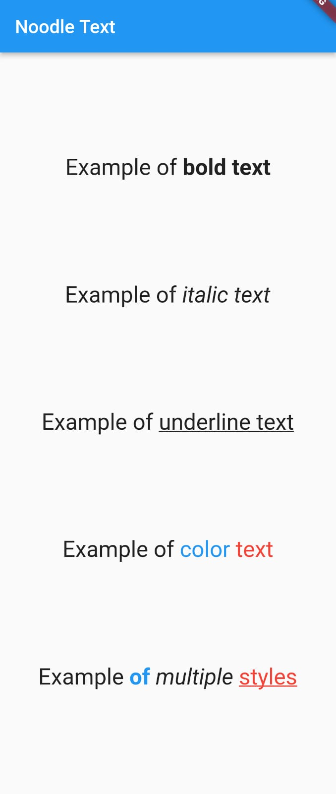

# NoodleText

## What is NoodleText?
A simple alternative to Flutter RichText to a using classic html tags like `<b>`, `<i>`.

## Example
```dart
Column(
    children: [
        NoodleText(
            'Example of <b>bold text</b>',
            style: const TextStyle(fontSize: 24),
        ),
        NoodleText(
            'Example of <i>italic text</i>',
            style: const TextStyle(fontSize: 24),
        ),
        NoodleText(
            'Example of <u>underline text</u>',
            style: const TextStyle(fontSize: 24),
        ),
        NoodleText(
            'Example of <c>color</c> <c>text</c>',
            style: const TextStyle(fontSize: 24),
            spanColors: const [Colors.blue, Colors.red],
        ),
        NoodleText(
            'Example <b><c>of</c></b> <i>multiple</i> <c><u>styles</u></c>',
            style: const TextStyle(fontSize: 24),
            spanColors: const [Colors.blue, Colors.red],
        ),
    ],
);
```

The result will be:





## Request updates
- To request updates or fixes, please open a pull request on Github.
